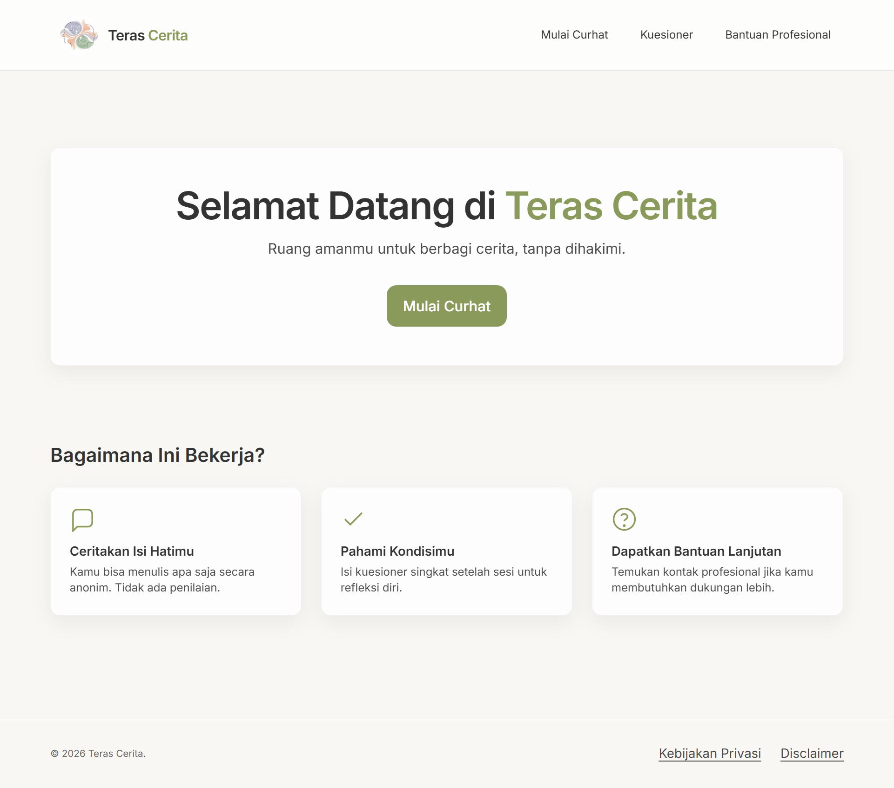
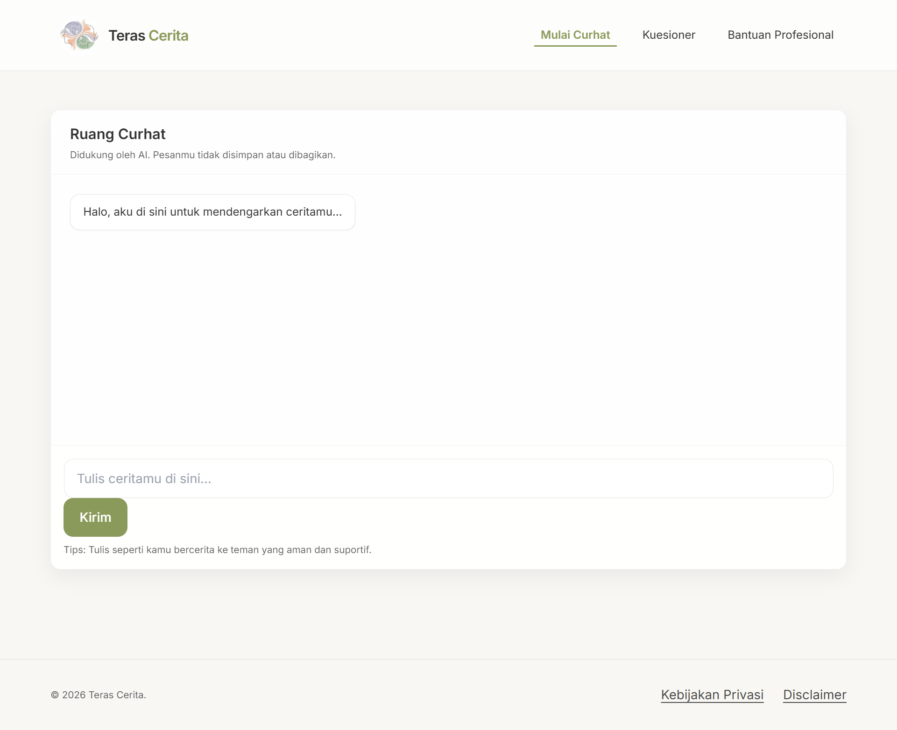
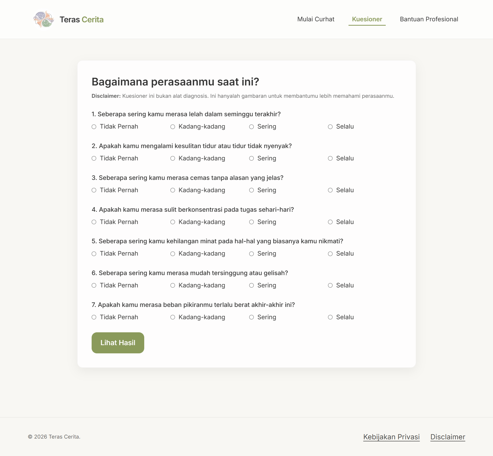
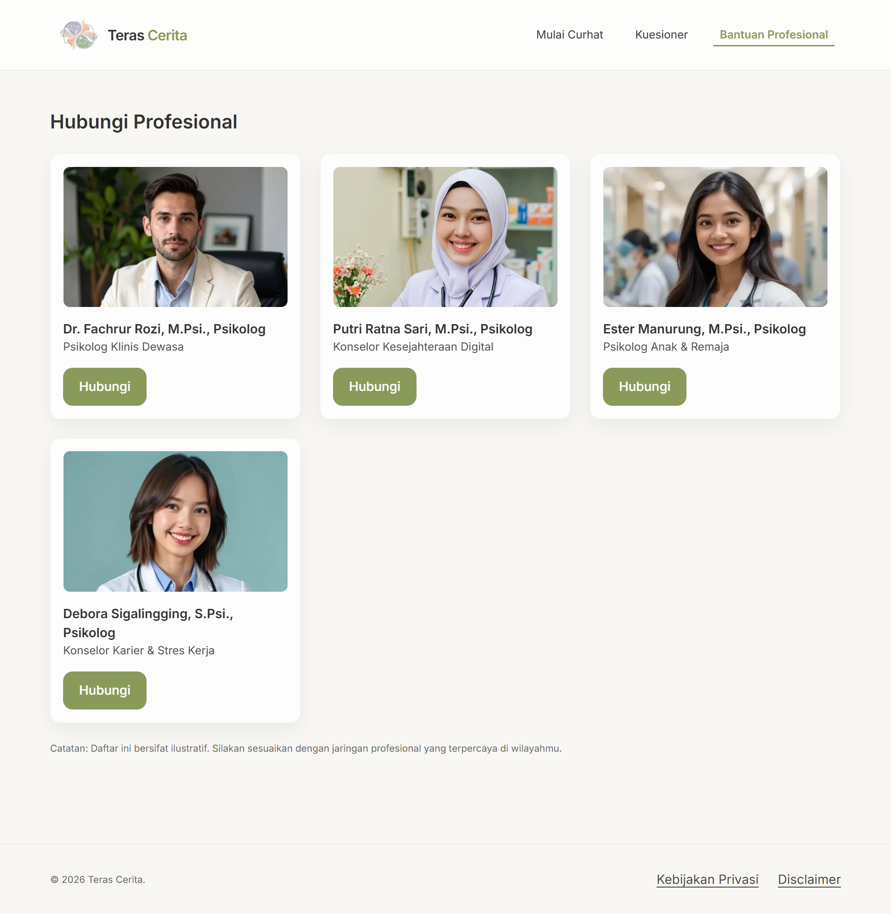

# 🏡 Teras Cerita

> **Cerita Yang Tak Terdengar, Kami Dengarkan.**  
> *Sebuah platform kesehatan mental yang aman, tenang, dan suportif untuk berbagi cerita, mengukur tingkat stres, dan terhubung dengan bantuan profesional.*

---

## 🎨 Gambaran Umum

**Teras Cerita** adalah aplikasi web berbasis Next.js dan Tailwind CSS yang dirancang sebagai ruang aman bagi pengguna untuk mengekspresikan emosi, merefleksikan kondisi psikologis mereka secara anonim, serta mencari bantuan profesional jika diperlukan.

---

## 📸 Tangkapan Layar (Screenshots)

Berikut adalah beberapa tampilan utama dari aplikasi **Teras Cerita**:

| Halaman Utama | Ruang Curhat |
| :---: | :---: |
|  |  |

| Kuesioner Stres | Bantuan Profesional |
| :---: | :---: |
|  |  |

> 💡 *Catatan: File screenshot Ada di folder `/public/screenshots/` dan sesuaikan nama file nya.*

---

## ✨ Fitur Utama

1. **🏡 Homepage (Beranda)**
   - Desain minimalis, estetis, dan menenangkan dengan palet warna Sage Green.
   - Penjelasan interaktif alur kerja platform ("Bagaimana Ini Bekerja?").
2. **💬 Ruang Curhat (AI-Powered)**
   - Fitur obrolan interaktif langsung dengan AI (terintegrasi dengan Flowise API).
   - Pengalaman bercerita yang sepenuhnya aman, instan, dan tanpa penyimpanan data pribadi untuk menjamin privasi.
3. **📝 Kuesioner Tingkat Stres**
   - Alat ukur singkat berisi 7 pertanyaan klinis sederhana untuk refleksi emosi.
   - Hasil kalkulasi skor otomatis yang langsung dikategorikan menjadi tingkat stres **Ringan**, **Sedang**, atau **Berat**, dilengkapi saran tindakan awal yang menenangkan.
4. **🤝 Kontak Bantuan Profesional**
   - Daftar psikolog klinis berlisensi lengkap dengan bidang spesialisasi masing-masing dan tombol aksi untuk konsultasi langsung.
5. **🔒 Keamanan & Hukum**
   - Halaman Kebijakan Privasi dan Disclaimer yang transparan untuk menjaga kenyamanan pengguna.

---

## 🛠️ Teknologi & Pustaka

Aplikasi ini dibangun menggunakan teknologi modern berkinerja tinggi:

- **Framework**: [Next.js 14.2.5 (App Router)](https://nextjs.org/)
- **Bahasa**: [TypeScript](https://www.typescriptlang.org/)
- **Styling**: [Tailwind CSS](https://tailwindcss.com/) & PostCSS
- **Font**: Inter (melalui `next/font`)
- **Ikon**: Desain SVG Kustom & Lucide React

---

## 🚀 Cara Menjalankan secara Lokal

Ikuti langkah-langkah di bawah ini untuk menjalankan proyek ini di komputer Anda:

### 1. Kloning & Persiapan
Buka terminal Anda, lalu arahkan ke direktori proyek ini.

### 2. Instalasi Dependensi
Jalankan perintah berikut untuk mengunduh semua pustaka yang dibutuhkan:
```bash
npm install
```

### 3. Konfigurasi Environment Variables (Opsional)
Untuk mengaktifkan fitur AI pada Ruang Curhat, buat file `.env.local` di direktori utama proyek dan tambahkan URL API Flowise Anda:
```env
NEXT_PUBLIC_FLOWISE_API_URL=https://api-flowise-anda.com/api/v1/prediction/...
```

### 4. Jalankan Server Pengembangan
Jalankan perintah ini untuk menyalakan server lokal:
```bash
npm run dev
```
*Jika Anda mengalami kendala saat menjalankan perintah di atas pada sistem Windows, Anda dapat menjalankannya langsung menggunakan Node:*
```bash
node node_modules/next/dist/bin/next dev
```

Buka browser kesayangan Anda dan akses [**http://localhost:3000**](http://localhost:3000).

---

## 📂 Struktur Direktori Proyek

```bash
teras-cerita/
├── app/                  # Router dan Halaman Utama Next.js
│   ├── bantuan/          # Halaman Hubungi Profesional
│   ├── curhat/           # Halaman Chat AI Curhat
│   ├── kuesioner/        # Halaman Kuesioner Stres
│   ├── kebijakan-privasi/# Halaman Kebijakan Privasi
│   ├── disclaimer/       # Halaman Disclaimer
│   ├── globals.css       # File Styling Utama & Design Tokens
│   └── layout.tsx        # Layout Induk Aplikasi (Header & Footer)
├── components/           # Komponen UI Reusable (Header, Footer, Result, dll)
├── public/               # Asset Statis (Gambar, Logo, Screenshots)
│   ├── images/           # Foto Ilustrasi Psikolog & Logo
│   └── screenshots/      # File screenshot halaman web Anda
├── tailwind.config.ts    # Konfigurasi Desain Sistem Tailwind CSS
└── package.json          # File konfigurasi dependensi & skrip npm
```

---

## 📝 Catatan Tambahan
Platform ini sepenuhnya dirancang di sisi klien (Client-Side) dan ramah privasi. Masukan curhat serta jawaban kuesioner Anda **tidak pernah disimpan** di server database manapun.

